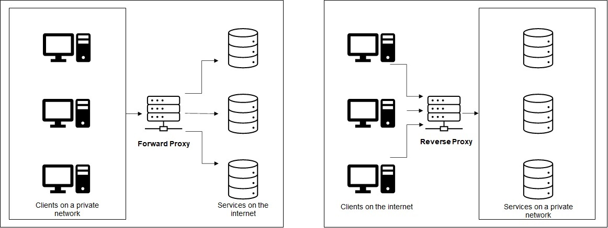
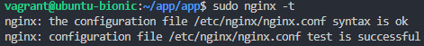
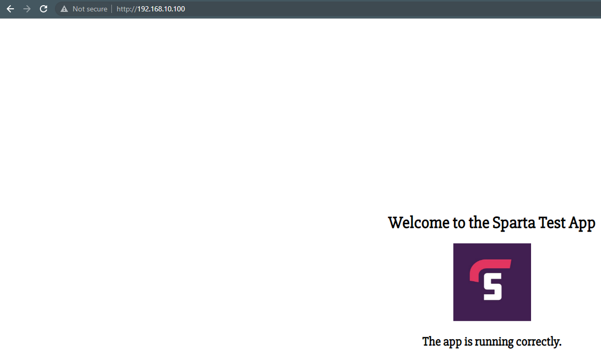
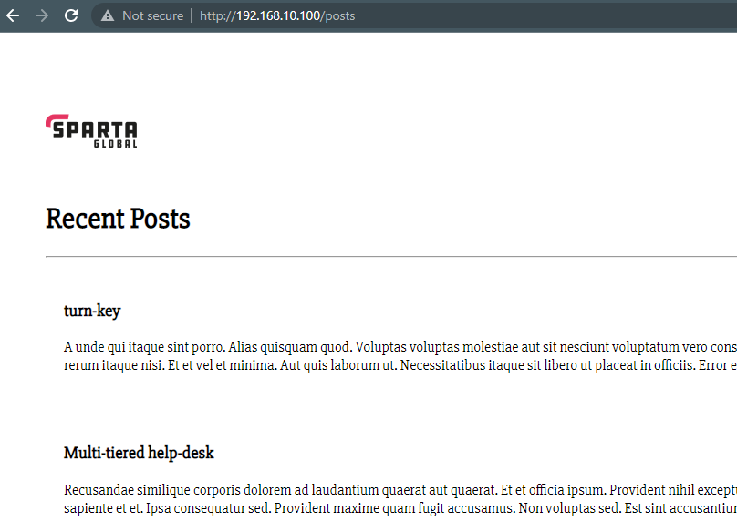

## **NGINX Reverse Proxy**

### **What are ports?**

A port (number) is a unique identifier for a network protocol that receives and transmits data for a specific service.

### **What is a reverse proxy? How is it different to a proxy?**

A reverse proxy is a type of proxy server that forwards and returns data from one of many other servers.

The client only communicates directly with the proxy server and the servers handling the requests are protected.

A forward proxy routes multiple clients traffic to an external network, where as a reverse proxy routes traffic on behalf of multiple servers.



### **Setting up an Nginx reverse proxy**

Run the application and confirm the message `Your app is ready and listening on port 3000` is displayed within the terminal.

To setup the Nginx reverse proxy, its configuration file requires amending to enable the server to respond to requests at its root.

1. Open the Nginx conguration file:

```
sudo nano /etc/nginx/sites-available/default
```

2. The file should display the following:

```nginx
##
# You should look at the following URL's in order to grasp a solid understanding
# of Nginx configuration files in order to fully unleash the power of Nginx.
# https://www.nginx.com/resources/wiki/start/
# https://www.nginx.com/resources/wiki/start/topics/tutorials/config_pitfalls/
# https://wiki.debian.org/Nginx/DirectoryStructure
#
# In most cases, administrators will remove this file from sites-enabled/ and
# leave it as reference inside of sites-available where it will continue to be
# updated by the nginx packaging team.
#
# This file will automatically load configuration files provided by other
# applications, such as Drupal or Wordpress. These applications will be made
# available underneath a path with that package name, such as /drupal8.
#
# Please see /usr/share/doc/nginx-doc/examples/ for more detailed examples.
##

# Default server configuration
#
server {
        listen 80 default_server;
        listen [::]:80 default_server;

        # SSL configuration
        #
        # listen 443 ssl default_server;
        # listen [::]:443 ssl default_server;
        #
        # Note: You should disable gzip for SSL traffic.
        # See: https://bugs.debian.org/773332
        #
        # Read up on ssl_ciphers to ensure a secure configuration.
        # See: https://bugs.debian.org/765782
        #
        # Self signed certs generated by the ssl-cert package
        # Don't use them in a production server!
        #
        # include snippets/snakeoil.conf;

        root /var/www/html;

        # Add index.php to the list if you are using PHP
        index index.html index.htm index.nginx-debian.html;

        server_name _;
        
        location / {
                # First attempt to serve request as file, then
                # as directory, then fall back to displaying a 404.
                try_files $uri $uri/ =404;
        }

        # pass PHP scripts to FastCGI server
        #
        #location ~ \.php$ {
        #       include snippets/fastcgi-php.conf;
        #
        #       # With php-fpm (or other unix sockets):
        #       fastcgi_pass unix:/var/run/php/php7.0-fpm.sock;
        #       # With php-cgi (or other tcp sockets):
        #       fastcgi_pass 127.0.0.1:9000;
        #}

        # deny access to .htaccess files, if Apache's document root
        # concurs with nginx's one
        #
        #location ~ /\.ht {
        #       deny all;
        #}
}


# Virtual Host configuration for example.com
#
# You can move that to a different file under sites-available/ and symlink that
# to sites-enabled/ to enable it.
#
#server {
#       listen 80;
#       listen [::]:80;
#
#       server_name example.com;
#
#       root /var/www/example.com;
#       index index.html;
#
#       location / {
#               try_files $uri $uri/ =404;
#       }
#}
```

3. Add the server name to the file:
   
```nginx
server_name 192.168.10.100;
```

4. Locate the servers location path and replace it with the following:

```nginx
        location / {
                proxy_pass http://localhost:3000;
                proxy_http_version 1.1;
                proxy_set_header Upgrade $http_upgrade;
                proxy_set_header Connection 'upgrade';
                proxy_set_header Host $host;
                proxy_cache_bypass $http_upgrade;
        }
```

5. Repeat `step 3` after the initial location code block and add another to enable the reverse proxy on the posts page.

```nginx
        location /posts {
                proxy_pass http://localhost:3000/posts;
                proxy_http_version 1.1;
                proxy_set_header Upgrade $http_upgrade;
                proxy_set_header Connection 'upgrade';
                proxy_set_header Host $host;
                proxy_cache_bypass $http_upgrade;
        }
```

>Note: Add `/posts` to instruct the proxy to pass to the posts web page.

6. Check that no syntax errors have been introduced to the configuration file, the following message should appear:

```
sudo nginx -t
```



7. Restart Nginx to relaunch the web server to include the addition of a reverse proxy:

```
sudo systemctl restart nginx
```

1. Navigate to the URL `http://192.168.10.100` and `http://192.168.10.100/posts` to access the web page; note, this does not include the port number anymore.



